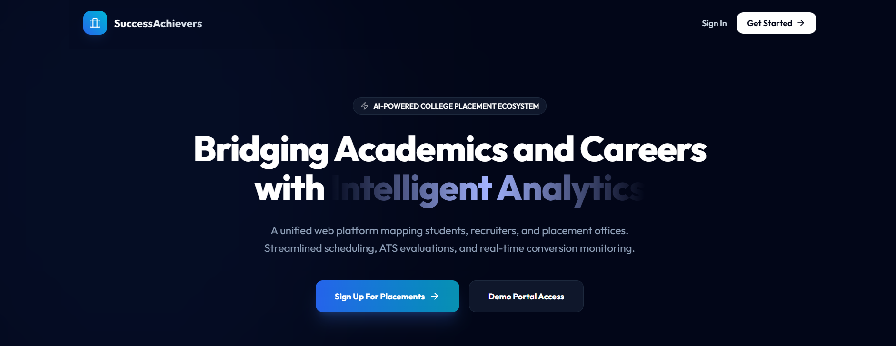
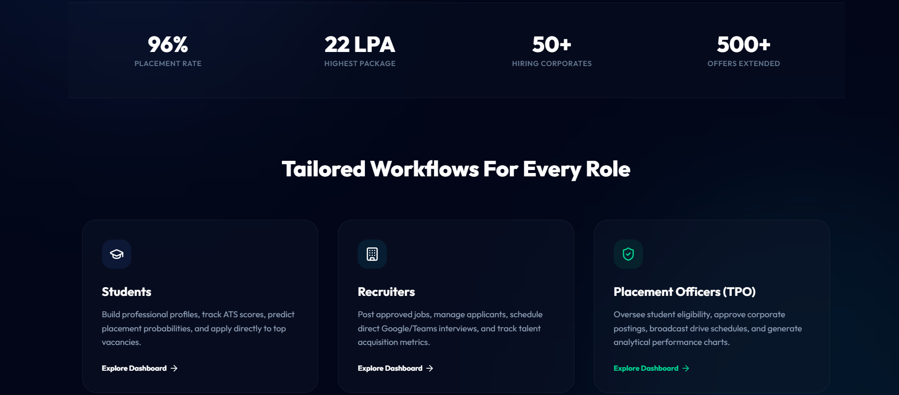
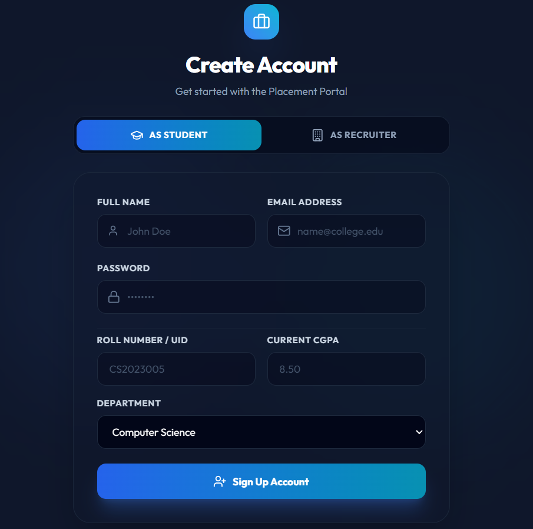
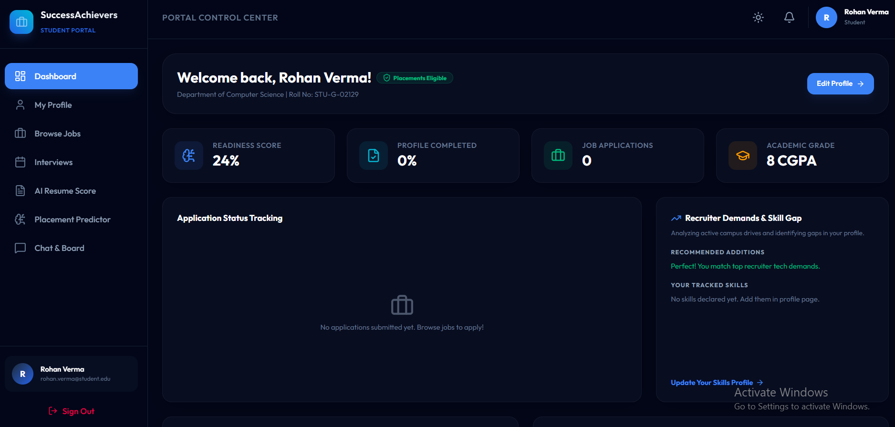

# 🎓 SuccessAchievers — College Placement Portal

> **AI-Powered College Placement Ecosystem** — Bridging Academics and Careers with Intelligent Analytics

[](https://college-placement-portal-app.vercel.app/)
[](https://college-placement-portal-fvu8.onrender.com)
[](https://github.com/Saifkhan1718/College-Placement-Portal)

---

## 📸 Screenshots

### 🏠 Landing Page


### 📊 Platform Stats & Role Workflows


### 📝 Student Registration


### 🖥️ Student Dashboard


---

## 🚀 About the Project

**SuccessAchievers** is a production-ready, full-stack College Placement Portal built with the MERN stack. It serves as a unified platform for Students, Recruiters, Training & Placement Officers (TPO), and Administrators — streamlining the entire campus recruitment lifecycle.

**Key Stats:**
- 96% Placement Rate
- 22 LPA Highest Package
- 50+ Hiring Corporates
- 500+ Offers Extended

---

## ✨ Features

### 👨‍🎓 Student
- Professional profile with resume upload
- Browse, search & filter jobs
- Apply and track application status (Applied → Shortlisted → Selected)
- AI Resume Analyzer with ATS Score
- Placement Predictor based on CGPA, skills & projects
- Skill gap analysis & readiness score

### 🏢 Recruiter
- Post, edit & manage job listings
- View & shortlist applicants
- Schedule interviews
- Track hiring conversion metrics

### 🏛️ Placement Officer (TPO)
- Manage student eligibility
- Approve recruiter job postings
- Schedule campus drives
- Department-wise placement analytics

### 🔐 Admin
- Full user & role management
- Audit logs & security monitoring
- System settings & access control

### 🤖 Smart Features
- AI Resume Analyzer (ATS Score + suggestions)
- Placement Predictor
- AI Chat Assistant for interview prep
- Real-time notifications via Socket.io
- In-app messaging & group announcements

---

## 🛠️ Tech Stack

### Frontend
| Technology | Purpose |
|---|---|
| React.js + Vite | UI Framework |
| Tailwind CSS | Styling |
| Framer Motion | Animations |
| Redux Toolkit | State Management |
| React Router | Navigation |
| Axios | API Calls |
| Recharts | Analytics Charts |

### Backend
| Technology | Purpose |
|---|---|
| Node.js + Express.js | Server |
| MongoDB + Mongoose | Database |
| JWT + bcrypt | Authentication |
| Socket.io | Real-time Features |
| Cloudinary | File/Resume Storage |
| Nodemailer | Email Notifications |
| Multer | File Uploads |

---

## 🚢 Deployment

| Service | Platform | URL |
|---|---|---|
| Frontend | Vercel | https://college-placement-portal-app.vercel.app |
| Backend | Render | https://college-placement-portal-fvu8.onrender.com |
| Database | MongoDB Atlas | Cloud Hosted |

> ⚠️ **Note:** The backend is on Render's free tier and may take ~50 seconds to wake up on first request after inactivity.

---

## ⚙️ Local Setup

### Prerequisites
- Node.js v18+
- MongoDB (local or Atlas)
- Git

### 1. Clone the Repository
```bash
git clone https://github.com/Saifkhan1718/College-Placement-Portal.git
cd College-Placement-Portal
```

### 2. Backend Setup
```bash
cd backend
npm install
```

Create `backend/.env`:
```env
PORT=5000
MONGODB_URI=mongodb://127.0.0.1:27017/placement_portal
JWT_SECRET=your_jwt_secret
NODE_ENV=development
EMAIL_SERVICE=gmail
EMAIL_USER=your-email@gmail.com
EMAIL_PASS=your-app-password
CLIENT_URL=http://localhost:5173
```

```bash
npm run dev
```

### 3. Frontend Setup
```bash
cd frontend
npm install
```

Create `frontend/.env`:
```env
VITE_API_URL=http://localhost:5000/api
```

```bash
npm run dev
```

### 4. Open in Browser
---

## 👥 User Roles

| Role | Access |
|---|---|
| **Student** | Profile, Jobs, Applications, AI Tools |
| **Recruiter** | Post Jobs, Manage Applicants, Interviews |
| **TPO** | Student Management, Analytics, Campus Drives |
| **Admin** | Full System Control |

---

## 📁 Project Structure

College-Placement-Portal/

├── backend/

│   ├── config/          # DB connection

│   ├── controllers/     # Route handlers

│   ├── middleware/      # Auth, error handling

│   ├── models/          # Mongoose schemas

│   ├── routes/          # API routes

│   ├── utils/           # Helper functions

│   └── server.js        # Entry point

├── frontend/

│   ├── src/

│   │   ├── components/  # Reusable UI components

│   │   ├── pages/       # Route pages

│   │   ├── store/       # Redux slices

│   │   └── main.jsx     # Entry point

│   └── vite.config.js

└── README.md

---

## 🔒 Security

- JWT Authentication with secure token handling
- Password hashing with bcrypt
- Rate limiting & Helmet.js
- CORS configuration
- Role-based access control
- Input validation & sanitization

---

## 📬 Contact

**Saif Khan**
- GitHub: [@Saifkhan1718](https://github.com/Saifkhan1718)
- Project Link: [College Placement Portal](https://github.com/Saifkhan1718/College-Placement-Portal)

---

⭐ If you found this project useful, please consider giving it a star!